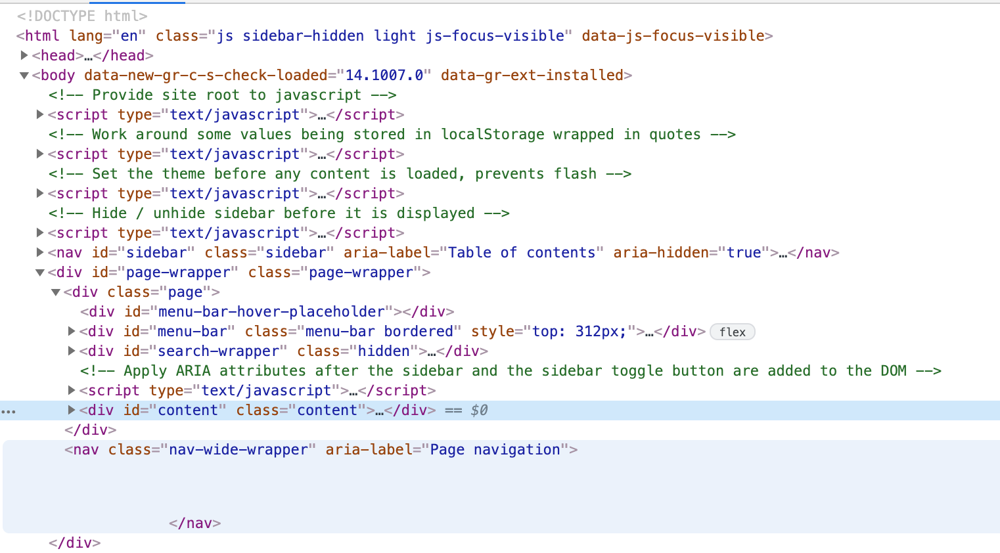

# 1. Introduction to Web Components

## What is  Web Components ?

- Custom Elements
- Shadow DOM
- HTML Template
- ES Module


### Custom Elements
-  Designing and using new types of DOM elements that are fully-featured and conforming.
-  Authors can define behaviors and styles for new HTML elements.
- Types of Custom Elements
    - Autonomous custom elements
        - Have none of the semantics of existing HTML elements
        - All behaviors need to be defined by the author of the custom element.
        ```js
        class AutonomousButton extends HTMLElement {
        ...
        }
        customElements.define("autonomous-button", AutonomousButton);
        ```
        ```html
        <autonomous-button>Click Me :)</autonomous-button>
        ```


    - Customized built-ins elements (Spec is work-in-progress, Only Chrome supports now)
        -  Extend existing HTML elements with custom functionality.
        -  Inherit semantics from the elements they extend.
        ```js
        class CustomizedButton extends HTMLButtonElement {
        ...
        }
        customElements.define("customized-button", CustomizedButton,
                              { extends: "button" });
        ```
        ```html
        <button is="customized-button">Click Me :)</button>
        ```

### Shadow DOM
- The DOM (Document Object Model) is a representation of the structure of an html document. The DOM models a document as a tree, with elements in parent-child relationships.
- 
-  DOM API contains no support for encapsulation. This makes it hard to develop **custom elements** 
    - Style information may **leak** into or out of other elements in the tree
    - IDs may overlap between custom elements and other elements in the document.
- Shadow DOM allows us to attach  **encapsulated DOM subtrees** to elements in a web document.
    - Style information inside them **cannot apply** to outside elements, and vice versa.
    ```js
    const header = document.createElement('header');
    const shadowRoot = header.attachShadow({mode: 'open'});
    shadowRoot.innerHTML = `<h1>Hello Shadow DOM</h1>`;
    ```


