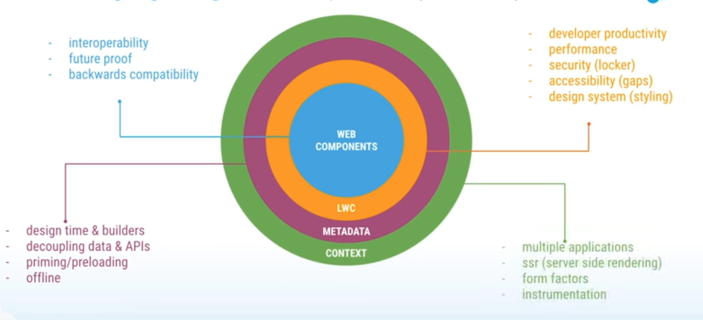
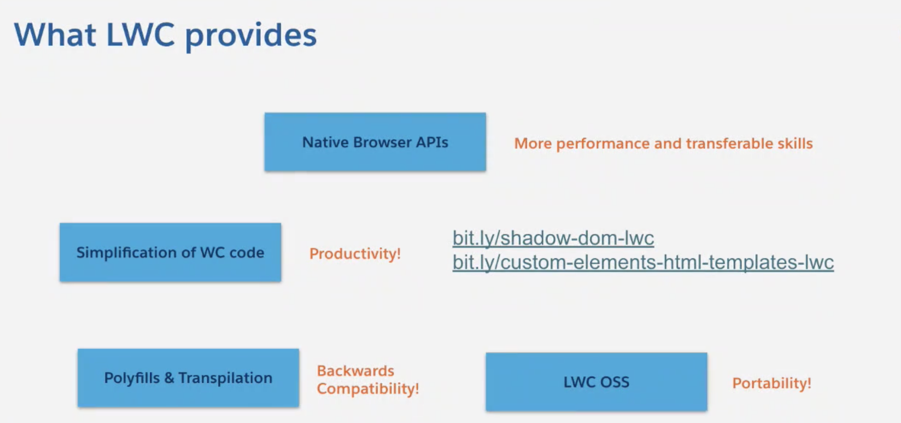

# 1. Introduction to Web Components

## What is  Web Components ?



- Custom Elements
- Shadow DOM
- HTML Template
- ES Module


### Custom Elements
-  Designing and using new types of DOM elements that are fully-featured and conforming.
-  Authors can define behaviors and styles for new HTML elements.
- Types of Custom Elements
    - Autonomous custom elements
        - Have none of the semantics of existing HTML elements
        - All behaviors need to be defined by the author of the custom element.
        ```js
        class AutonomousButton extends HTMLElement {
        ...
        }
        customElements.define("autonomous-button", AutonomousButton);
        ```
        ```html
        <autonomous-button>Click Me :)</autonomous-button>
        ```


    - Customized built-ins elements (Spec is work-in-progress, Only Chrome supports now)
        -  Extend existing HTML elements with custom functionality.
        -  Inherit semantics from the elements they extend.
        ```js
        class CustomizedButton extends HTMLButtonElement {
        ...
        }
        customElements.define("customized-button", CustomizedButton,
                              { extends: "button" });
        ```
        ```html
        <button is="customized-button">Click Me :)</button>
        ```

### Shadow DOM
- The DOM (Document Object Model) is a representation of the structure of an html document. The DOM models a document as a tree, with elements in parent-child relationships.
- 
-  DOM API contains no support for encapsulation. This makes it hard to develop **custom elements** 
    - Style information may **leak** into or out of other elements in the tree
    - IDs may overlap between custom elements and other elements in the document.
- Shadow DOM allows us to attach  **encapsulated DOM subtrees** to elements in a web document.
    - Style information inside them **cannot apply** to outside elements, and vice versa.
    ```js
    const header = document.createElement('header');
    const shadowRoot = header.attachShadow({mode: 'open'});
    shadowRoot.innerHTML = `<h1>Hello Shadow DOM</h1>`;
    ```
- [Shadow DOM Example](http://localhost:3000/code/c1/shadowDom.html)
- By default, if an element has shadow DOM, the shadow tree is rendered instead of the element's children.
- To allow children to render, you need to add placeholders for them in your shadow tree. To do this in shadow DOM:
```html
<!-- shadow tree for <my-header> -->
<header>
   <h1><slot></slot></h1>
   <button>Menu</button>
</header>
```
```html
<my-header>Shadow DOM</my-header>
```
- The header renders as if the <slot> element was replaced by the children:
```html
<my-header>
  <header>
     <h1>Shadow DOM</h1>
     <button>Menu</button>
  </header>
</my-header>

```
- Each LWC has a shadow DOM tree attached

## LWC offers




## LWC component is composed of three files
- 1. HTML template 
    - From HTML Template spec (Greeting.html)
```html
<template>
     <p>Welcome to LWC!</p>
     <p>{msg.morning}</p>
     <p>{equation}</p>
</template>
```
    - It will be rendered like this: (kebab-case)
```html
        <c-greeting>
            <p>Welcome to LWC!</p>
            <p>{msg.morning}</p>
            <p>{equation}</p>
        </c-greeting>


```
- 2. Javascript file (Greeting.js)
    - ES6 Modules spec (import, export)
    - Custom Element Spec (LightningElement)
```js
import { LightningElement } from 'lwc';
export default class Greeting extends LightningElement {
    msg =  { morning: 'All great things are simple!',
             evening: 'A person who never made a mistake never tried anything new!'
           } // attribute

    get equation() { // you can do calculations in getters
        return 'e=mc**2';
    }

}

```
- 3. metadata file ( to deploy the component into the Salesforce Platform)
```xml
<?xml version="1.0" encoding="UTF-8"?>
<LightningComponentBundle xmlns="http://soap.sforce.com/2006/04/metadata">
    <apiVersion>51.0</apiVersion>
    <isExposed>false</isExposed>
</LightningComponentBundle>

```
- [Greeting in Playground](https://webcomponents.dev/edit/bGdrbd1FgVFX9tXS7Ubb/src/app.html)

## Practice

- Kovai-Contact
    - WC
        - [wc - Kovai-Contact component in Playground](https://webcomponents.dev/edit/IJgOSRDGGgLfBttpm68W/src/index.js)
        - [wc - Kovai-Contact component with SVG in Playground](https://webcomponents.dev/edit/77FkRghy5tt4ikhnUnge/src/index.js)
    - LWC
        - [lwc - Kovai-Contact component in Playground](https://webcomponents.dev/edit/Mdnsri52E4oYwk4gv7YU/src/app.html)
        - [REST and datatable with Filter](https://webcomponents.dev/edit/eCOqgjCZEvP30GkAeuop/src/app.js)

## References
- [Web Components Spec](https://www.webcomponents.org/specs)
- [MDN Web components](https://developer.mozilla.org/en-US/docs/Web/Web_Components)
- [Web Components: The Secret Ingredient Helping Power The Web](https://www.youtube.com/watch?v=YBwgkr_Sbx0)
- [Web Components Crash Course](https://www.youtube.com/watch?v=PCWaFLy3VUo)

### Custom Elements
- [Custom Elements & HTML Templates | Developer Quick Takes ](https://www.youtube.com/watch?v=6rK3AyxE-54&t=3s)
### Shadow DOM
- [Explaining the Shadow DOM | Developer Quick Takes](https://www.youtube.com/watch?v=K5i9zMzVlzM)

### Use anywhere
- [Build Connected Apps Anywhere Using Lightning Base Components](https://developer.salesforce.com/blogs/2020/12/build-connected-apps-anywhere-using-lightning-base-components.html)
- [Build Apps with Lightning Web Components Open Source](https://trailhead.salesforce.com/en/content/learn/trails/build-apps-lightning-web-components-open-source)


