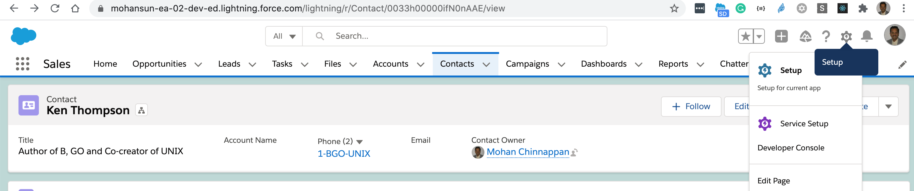
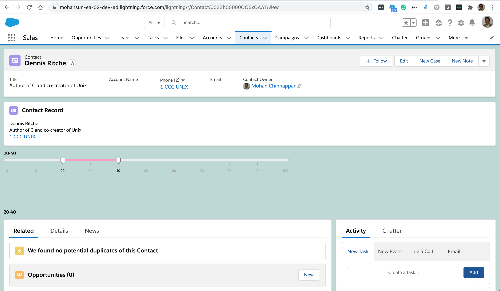
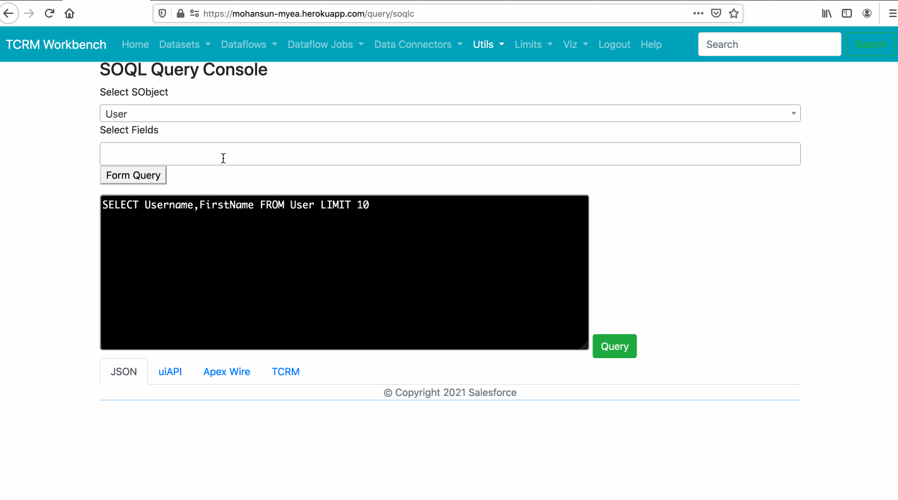
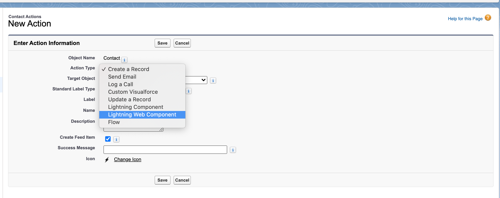

# Development Environment


## Create a sfdx project

- [CREATE A SALESFORCE DX PROJECT](https://mohan-chinnappan-n.github.io/sfdc/dx.html#/37)

## File Structure
- Create sfdx  project kovai
```
 sfdx force:project:create -n kovai

```

- Project file
```
$ cat kovai/config/project-scratch-def.json 
{
  "orgName": "mchinnappan company",
  "edition": "Developer",
  "features": ["EnableSetPasswordInApi"],
  "settings": {
    "lightningExperienceSettings": {
      "enableS1DesktopEnabled": true
    },
    "mobileSettings": {
      "enableS1EncryptedStoragePref2": false
    }
  }
}
```


- create contactCard lwc component **contactCard**

```
$ cd kovai
$ cat create_lwc.sh 
sfdx force:lightning:component:create -n contactCard --type lwc -d lwc/main/default/lwc/

```

- Folder structure 
```
$ tree kovai
kovai
├── README.md
├── config
│   └── project-scratch-def.json
├── contactCard-1.png
├── create_lwc.sh
├── deploy_lwc.sh
├── lwc
│   └── main
│       └── default
│           ├── applications
│           ├── aura
│           ├── classes
│           ├── contentassets
│           ├── flexipages
│           ├── layouts
│           ├── lwc
│           │   └── contactCard
│           │       ├── contactCard.html
│           │       ├── contactCard.js
│           │       └── contactCard.js-meta.xml
│           ├── objects
│           ├── permissionsets
│           ├── staticresources
│           ├── tabs
│           └── triggers
├── package.json
├── scripts
│   ├── apex
│   │   └── hello.apex
│   └── soql
│       └── account.soql
└── sfdx-project.json


```

- Edit the component files 
    - Markup: contactRecord.html
```xml

<template>
    <lightning-card title="Contact Record" icon-name="standard:contact">
        <template if:true={contact.data}>
            <div class="slds-m-around_medium">
                <p>{name}</p>
                <p>{title}</p>
                <p><lightning-formatted-phone value={phone}></lightning-formatted-phone></p>
                <p><lightning-formatted-email value={email}></lightning-formatted-email></p>
            </div>
        </template>
    </lightning-card>
</template>

```

    - Javascript : contactRecord.js

```js
import { LightningElement, api, wire } from 'lwc';
import { getRecord } from 'lightning/uiRecordApi';

const FIELDS = [
    'Contact.Name',
    'Contact.Title',
    'Contact.Phone',
    'Contact.Email',
];

export default class WireGetRecordDynamicContact extends LightningElement {
    @api recordId;

    // Let’s use the wire service to get record data and display some field names.

    @wire(getRecord, { recordId: '$recordId', fields: FIELDS })
    contact;

    get name() {
        return this.contact.data.fields.Name.value;
    }

    get title() {
        return this.contact.data.fields.Title.value;
    }

    get phone() {
        return this.contact.data.fields.Phone.value;
    }

    get email() {
        return this.contact.data.fields.Email.value;
    }
}

```

    - Metadata file : contactRecord.js-meta.xml 

```xml
<?xml version="1.0" encoding="UTF-8"?>
<LightningComponentBundle xmlns="http://soap.sforce.com/2006/04/metadata">
    <apiVersion>51.0</apiVersion>
    <isExposed>true</isExposed>

    

    <targets>
        <target>lightning__RecordPage</target>
        <target>lightning__AppPage</target>
        <target>lightning__HomePage</target>
    </targets>


</LightningComponentBundle>

```
- Deploy to the org after you logged into the org with:
```
$ sfdx force:auth:web:login

```

```
sfdx force:source:deploy -u mohan.chinnappan.n_ea2@gmail.com -p lwc/main/default/lwc/contactCard
```

- Edit the Contact Home Page



- Update Contact Home Page 
    - Supplies recordId



<a name='lwctcrm'></a>
## Using LWC in TCRM


### LWC with a Step in TCRM


### Code generator for LWC with a Step in TCRM 



## Using Modals in LWC

- [Component to show the Financial Accounts in FSC](https://github.com/mohan-chinnappan-n/FSCConfigUI/tree/master/FA)
- [Using HTML table, onmouseout, mouseover](https://webcomponents.dev/edit/KN7WTWkxd8pnOfUL8KjQ/src/app.js)

## How to Create Quick Actions with Lightning Web Components
- [Create Quick Actions with Lightning Web Components (Generally Available) ](https://help.salesforce.com/articleView?id=release-notes.rn_lwc_quick_actions.htm&type=5&release=232)
```xml
<?xml version="1.0" encoding="UTF-8" ?>
<LightningComponentBundle xmlns="http://soap.sforce.com/2006/04/metadata">
   <apiVersion>52.0</apiVersion>
   <isExposed>true</isExposed>
   <targets>
       <target>lightning__RecordAction</target>
   </targets>
    <targetConfigs>
   <targetConfig targets="lightning__RecordAction">
     <actionType>Action</actionType>
   </targetConfig>
 </targetConfigs>
</LightningComponentBundle>

```

```js

import { LightningElement, api } from 'lwc';

export default class ContactAction extends LightningElement {
    @api invoke() {
        console.log("Hi, I'm an action.");
    }

}

```

```html

 <template>
   <p>LWC Action Test</p> 
</template>

```




## References
- [VS Code with Salesforce Extensions](https://bit.ly/sfvscode)
- [Salesforce CLI](https://sfdc.co/sfcli)
- [Debugging config in org and Chrome Dev Tools](https://sforce.co/2V6EKJm)
- [Local Dev Server](https://sfdc.co/localdevserver)