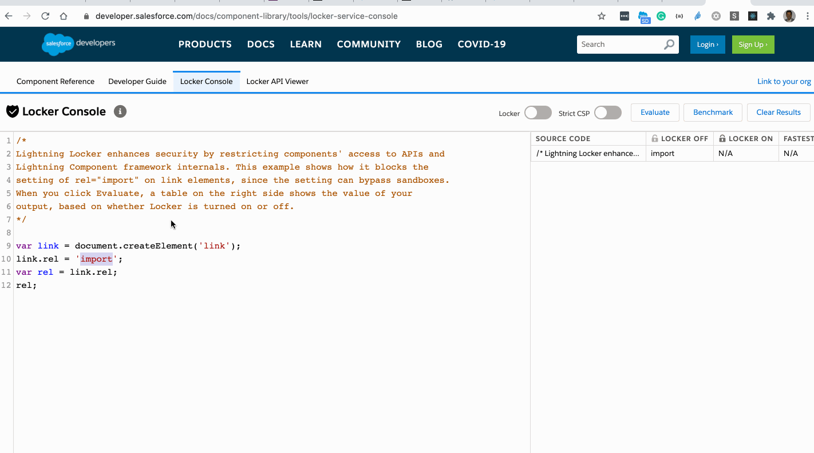
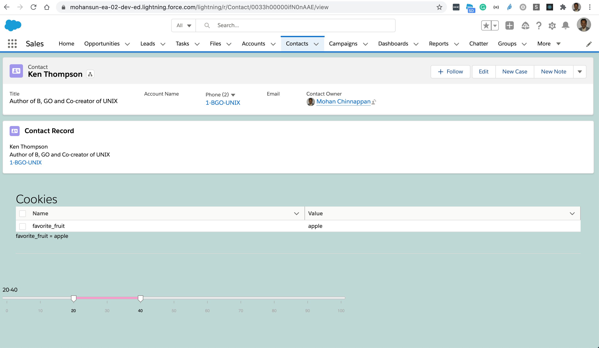

# 8. Security with Lightning Locker

- Lightning Locker provides:
    - component isolation and security that allows code from many sources to execute and interact using safe, standard APIs and event mechanisms. 
    
    - Lightning Locker is enabled for all custom Lightning web components.


## strict mode ```"use strict"```
- Lightning Locker implicitly enables JavaScript strict mode everywhere
- JavaScript strict mode makes code more secure, robust, and supportable.


## DOM Access Containment
- A component **can only traverse the DOM and access elements that it created**. 
    - This behavior prevents the anti-pattern of reaching into DOM elements owned by other components.
- Lightning web components can’t use the ```window``` or ```document``` global properties to query for DOM elements. 
- For example, use ```this.template.querySelector()``` instead of ```document.querySelector()```.

## Secure Wrappers
- For security, Lightning Locker restricts **the use of global objects by hiding an object or by wrapping it in a secure version of the object**. 
    - For example, the secure version of window is ```SecureWindow```. 
    - Locker intercepts calls to window and uses SecureWindow instead.

## Third-Party Web Components
- To prevent security risks, you can’t use third-party web components on the Salesforce platform.
- Web components are custom elements. To define a custom element, you must use the customElements.define API. However, this API is global, and allows you to globally register a component name. 
- Registering a name globally is a security risk because an attacker could register any name and take over the page. 
- Lightning Locker’s SecureWindow wrapper blocks the **customElements** methods that create custom web components.

## Locker Console
- We can use [locker console](https://developer.salesforce.com/docs/component-library/tools/locker-service-console) to check your code
- [Locker API Viewer](https://developer.salesforce.com/docs/component-library/tools/locker-service-viewer)
- [Build Secure Apps with Lightning Web Components](https://trailhead.salesforce.com/en/content/learn/modules/secure-clientside-development/build-secure-apps-with-lightning-web-components)

### Demo of using Locker  Console

- [Playground showing using cookie datatable](https://webcomponents.dev/edit/3lTiTgKhJdAV3u6IRl4F/src/app.js)


```js
/*
Lightning Locker enhances security by restricting components' access to APIs and
Lightning Component framework internals. 
- The example #1 shows how it blocks the setting of rel="import" on link elements, since the setting can bypass sandboxes.
When you click Evaluate, a table on the right side shows the value of your 
output, based on whether Locker is turned on or off.

- The example #2 shows results of document.cookie
- 
*/

var link = document.createElement('link');
link.rel = 'import';
var rel = link.rel;
rel;

 const cookies = [];

 const citems = document.cookie.split(';');
    citems.forEach( item => {
      const [name, value] = item.split('=');
      cookies.push( {name, value});
      
 });
JSON.stringify(cookies, null,4);
```

-  Note: Your LWC component is limited in accessing ```document.cookie```
     - only cookies that were  set from the LWC component can be accessed.

### Component code 
```js
import { LightningElement } from "lwc";

const columns = [

   {fieldName: "name", label: 'Name'},
   {fieldName: "value", label: 'Value'},
    
];

export default class App extends LightningElement {
  title = "Cookies";

  columns = columns;

    // Note: Your LWC component is limited in accessing document.cookie
    // -  only cookies that were set from the LWC component can be accessed.

    get cookies() {
    document.cookie = "favorite_fruit=apple";
    const citems = document.cookie.split(';');
    const cookies = [];
    citems.forEach( item => {
      const [name, value] = item.split('=');
      cookies.push( {name, value});
    });
    return cookies;

  }
  
}

```

### Component markup
```html
<template>
	<div class="app slds-p-around_x-large">
		<h1 class="slds-text-heading_large">{title}</h1>

		<lightning-datatable key-field="name" data={cookies} columns={columns}>
		</lightning-datatable>

		<template for:each={cookies} for:item="cookie">
			<div key={cookie.value}>
				{cookie.name} = { cookie.value}
				<hr />
			</div>
		</template>


	</div>
</template>

```

### Component use




