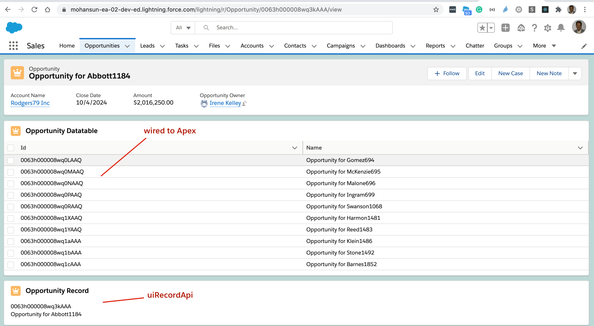

# Using Salesforce Data

## Code Generator for the given SOQL 


### Usage 

## Using uiRecordApi

### Component Markup Contact.html

```xml
<template>
    <lightning-card title="Contact Record" icon-name="standard:contact">
        <template if:true={contact.data}>

                <template for:each={contact.data} for:item="contact">
                     <p>{id}</p><p>{name}</p>
                </template>

            <div class="slds-m-around_medium">
            </div>
        </template>
    </lightning-card>
</template>
```
### Component Javascript: Contact.js
```js
import { LightningElement, api, wire } from 'lwc';
import { getRecord } from 'lightning/uiRecordApi';

const FIELDS = [ 'Contact.Id','Contact.Name', ];

export default class WireGetRecordContact extends LightningElement {
    @api recordId;

    // Let’s use the wire service to get record data and display some field names.

    @wire(getRecord, { recordId: '$recordId', fields: FIELDS })
    contact;


    get id() {
        return this.contact.data.fields.Id.value;
    }

    get name() {
        return this.contact.data.fields.Name.value;
    }


}
```

### Component metadata Contact.js-meta-xml
```xml
<?xml version="1.0" encoding="UTF-8"?>
<LightningComponentBundle xmlns="http://soap.sforce.com/2006/04/metadata">
    <apiVersion>51.0</apiVersion>
    <isExposed>true</isExposed>

    <targets>
        <target>lightning__RecordPage</target>
        <target>lightning__AppPage</target>
        <target>lightning__HomePage</target>
    </targets>

</LightningComponentBundle>
```

## Using Apex controller


### Apex Controller OpportunityController.cls

```java
// OpportunityController.cls
public with sharing class OpportunityController {    
    @AuraEnabled(cacheable=true)
    public static List<Opportunity> getOpportunityList() {
        return [
          SELECT Id,Name FROM Opportunity LIMIT 10
        ];
    }
}
```


### Apex Controller OpportunityController.cls.meta.xml
```xml
<?xml version="1.0" encoding="UTF-8"?>
<ApexClass xmlns="http://soap.sforce.com/2006/04/metadata">
    <apiVersion>51.0</apiVersion>
    <status>Active</status>
</ApexClass>
```

### Component Markup Opportunity.html
```html
<template>
    <lightning-card title="Opportunity Datatable" icon-name="standard:opportunity">
        <template if:true={opportunitys.data}>
            <lightning-datatable
            key-field="id"
            data={opportunitys.data}
            columns={columns}>
        </lightning-datatable>

        </template>
    </lightning-card>
</template>
```


### Component Javascript: Opportunity.js
```js
import { LightningElement,  wire } from 'lwc';
import getOpportunityList from '@salesforce/apex/OpportunityController.getOpportunityList';


export default class ApexWireGetRecordsOpportunity extends LightningElement {

    columns = [{  label: 'Id', fieldName: 'Id' },
{  label: 'Name', fieldName: 'Name' },
];
    // Let’s use the apex wire service to get record data and display some field names.
    @wire(getOpportunityList)
    opportunitys;

}
```

### Component metadata Opportunity.js-meta-xml
```xml
<?xml version="1.0" encoding="UTF-8"?>
<LightningComponentBundle xmlns="http://soap.sforce.com/2006/04/metadata">
    <apiVersion>51.0</apiVersion>
    <isExposed>true</isExposed>

    <targets>
        <target>lightning__RecordPage</target>
        <target>lightning__AppPage</target>
        <target>lightning__HomePage</target>
    </targets>

</LightningComponentBundle>
```


